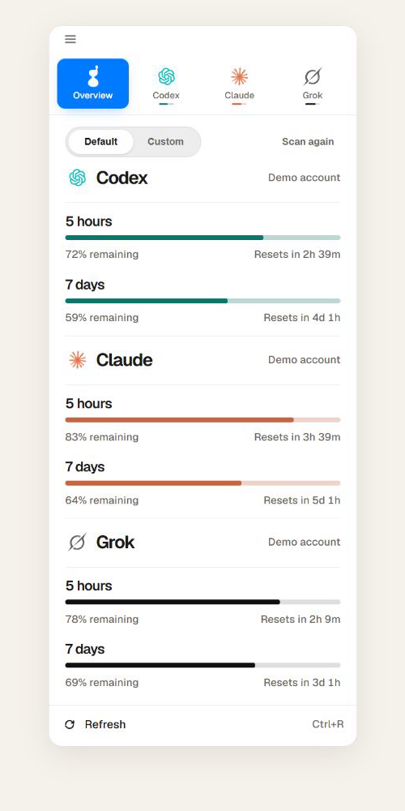
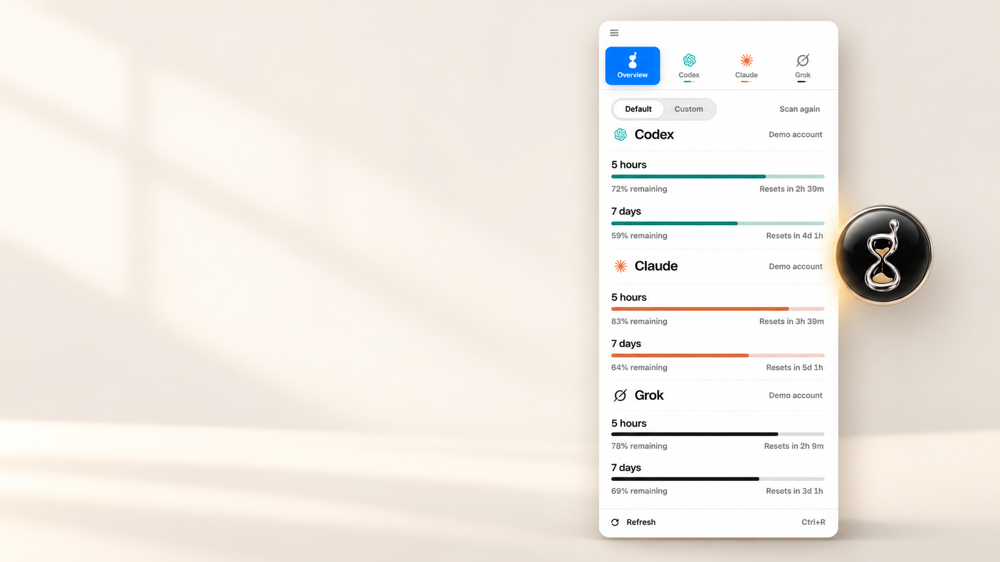

[English](README.md) | **简体中文**

# Sandglass

一个只读的本地 AI 用量仪表盘。Sandglass 自动发现本机的模型工具和账号，统一展示 Token 消耗、官方套餐余量与重置时间。

数据留在本机，不上传；Sandglass 不切换账号、不刷新凭据，也不修改厂商目录。

**多语言 UI——完整支持 10 种语言。** 首次使用时自动跟随 Windows 系统语言，
之后可随时从应用菜单切换：**English · 简体中文 · 繁體中文 · Español · Français · Deutsch · Português (Brasil) · Русский · 日本語 · 한국어**。

## 下载 Windows 10/11 x64 版

### [下载安装包——推荐](https://github.com/taiyun668/Sandglass/releases/download/v0.1.7/Sandglass-0.1.7-windows-x64-unsigned-setup.exe)

适合大多数用户。它会为当前 Windows 用户安装 Sandglass，创建桌面和开始菜单快捷方式，
安装完成后启动应用，并支持以后的应用内升级。**只有你在 Sandglass 中主动启用时，软件才会开机启动。**

### [下载便携 ZIP](https://github.com/taiyun668/Sandglass/releases/download/v0.1.7/Sandglass-0.1.7-windows-x64-unsigned-portable.zip)

不想安装时选择这个版本。请先解压完整 ZIP，进入 `Sandglass` 文件夹，再运行
`Sandglass.exe`；不要直接在压缩包里运行。便携版以后通过应用内升级时，会按设计转入安装版通道。

> **Windows Smart App Control：**Sandglass 目前没有 Authenticode 代码签名。
> 当 Smart App Control 处于强制模式时，Windows 可能同时阻止安装包和便携 ZIP
> 内的可执行文件，而且没有针对单个应用的“仍要运行”选项。不要为了安装 Sandglass
> 而关闭 Windows 安全功能。Owner 签名的校验清单能证明发布资产未被篡改，
> 但它不是 Windows 受信任发布者签名。

[更新说明和全部文件](https://github.com/taiyun668/Sandglass/releases/latest)
· [SHA-256 校验清单](https://github.com/taiyun668/Sandglass/releases/download/v0.1.7/SHA256SUMS.windows)
· [Owner 签名](https://github.com/taiyun668/Sandglass/releases/download/v0.1.7/SHA256SUMS.windows.sig)

<p align="center">
  
</p>
<p align="center"><sub>隐私安全的合成演示数据；不包含任何真实账号或用量信息。</sub></p>

## 悬浮球与磁吸面板

悬浮球可以自由拖动，也可以吸附在屏幕边缘。点击悬浮球后，窄面板会在同一侧贴合展开；
最小化面板后回到悬浮球，后台观测不会停止。

<p align="center">
  
</p>

<p align="center">
  
</p>

<p align="center"><sub>基于真实 Sandglass UI 与品牌资产制作的展示合成图；只使用演示数据。</sub></p>

> **观测从 Sandglass 介入后开始形成完整证据链。** 安装前的历史只有在官方本机
> 信源能够直接证明时才会归属到账号；证明不了的部分会如实保持未归属，不会按
> 当前登录账号倒推过去。

首次使用必须选择一种账本路径：选择单账号、只用官方工具后，Sandglass 会把每个平台
监测到的官方本机用量归到该平台当前账号；扫描到旧账号不会擅自改变用户的选择。只要涉及
多账号、多工具、账号切换，或需要重建、补齐、更新账本，也可以选择 Adapter Skill 路径。
后一种路径不会抹掉已有直接证据：能够证明账号的本机 Token 仍正常归属，只有证据缺口
等待 skill 补齐。两种模式都只在读取时生效，不改写缓存或身份账本，切换后可完整回退。
从菜单进入“账号与工具模式”后也可以返回而不保存；只有明确点选另一个模式才会改变读取视图。

## 当前支持

| 厂商 | 本机消耗 | 本机账号发现 | 官方余量 |
| --- | --- | --- | --- |
| Claude | Claude Code 会话日志 | Claude 配置目录 | 5 小时、7 天及模型窗口 |
| Codex | CLI / Desktop rollout 日志 | 官方当前登录资料及 Sandglass 开始运行后的观测记录 | 5 小时、7 天及 credits |
| Grok | Grok CLI `turn_completed` | 官方 Grok Build CLI 当前登录资料、官方身份事件及 Sandglass 持久身份账本 | 周期额度与产品窗口 |

“自动发现所有账号”指所有受支持厂商在本机留下可识别登录资料的账号。未登录、未落地到本机，或厂商没有提供日志/额度信源的账号无法被推断。

Sandglass 公众版不读取 `~/.codex/accounts/registry.json`、社区 `grok-app` 或其他第三方账号工具的数据。Codex 由 Sandglass 从介入后持续记录官方登录变化；Grok 还会合并官方 CLI 自己写下的身份事件。身份账本决定哪些历史账号存在，邮箱、套餐等元数据只负责补充显示。

### 能看到什么

| 能看到 | 看不到 |
| --- | --- |
| 受支持官方客户端写在这台电脑上的 Token 用量 | 其他设备上没有同步到本机官方日志的用量 |
| 官方本机登录资料能够证明的账号与身份变化 | 未登录、仅存在云端或未在本机留下官方资料的账号 |
| 厂商账号级官方余量和重置时间；其中可能包含其他设备 | 默认未接入的第三方工具、纯网页聊天或需要解密进程流量才能观察的活动 |
| 用户显式接入的本机来源；Sandglass 会原样收下并标出认识与不认识的字段 | 用户来源没有直接提供的事实；Sandglass 不会用现有三家模型替用户裁决未知数据 |
| 官方客户端在本机记下的那些调用 | **官方客户端没有记下的那些**：厂商完成了一次调用却没有写进本机会话文件时，这台电脑上没有任何东西证明它发生过 |

最后一行不是假设。2026-09-07 在这台机器上量到过一次：厂商自己的 OTLP 事件流里有一次
已完成的调用，而同一个会话的本机记录文件里没有它的任何痕迹——不是记到了别的时间，是根本
不存在。**所以本机总量的下界是可信的，上界不是。** 这也是 Sandglass 支持接收官方 OTLP
的原因之一：它是本机唯一能看见这种遗漏的旁证。

Sandglass 是本机观测仪表盘，不是计费、成本核算或发票对账工具。

## 信源

Sandglass 按以下顺序相信数据：

1. 官方客户端写下的逐轮会话日志；
2. 官方客户端的账号注册表和认证事件；
3. 厂商第一方额度接口；
4. Sandglass 自己记录的观测时间与账号归属台账。

本地日志和额度地址属于第一方客户端/服务信源，但不一定是厂商承诺长期稳定的公开 API。某个额度接口失效时，本机消耗仍可统计，面板会把余量标成暂不可用，不会猜数。

Sandglass 已开始持续监测 Grok 账号的官方额度、重置时间和本机用量归属。开始观测前若没有可验证的账号登录或切换事件，早期用量将统一显示为“未归属”，不会按当前登录账号猜测或补填。

三家官方 OTel、本机日志、身份事件、额度接口与第三方适配器的证据等级见
[`docs/provider-source-map.md`](docs/provider-source-map.md)。
官方发布包只内置经过项目验证的信源。多账号、多工具或需要重建、补齐、更新账本时，
用户按
[`docs/custom-source-contract.md`](docs/custom-source-contract.md) 显式接入其他本机来源；
这类数据始终标成用户适配器证据，不冒充官方账号、额度或重置状态。
完整适配机制可在 [`skills/sandglass-adapter/`](skills/sandglass-adapter/) 取得并交给
本机编码 agent；其中 `SKILL.md` 负责工作流与边界，`references/` 按需提供重建知识，
`scripts/` 只承载确定性操作。agent 会先探测这台机器实际使用的工具和直接信源，再把
原始形状送进独立收件箱；Sandglass 的镜子会说明认识了什么、没认识什么以及当前使用
阶段。收到数据本身不会改动账号或合计；用户明确关联账号后，只有与本机第一方记录
在厂商、会话、UTC 分钟及全部 Token 桶上精确一致的分钟才会补充账号归属，不新增
Token，取消关联即可撤销。对本机不存在且无跨会话、跨来源碰撞的分钟，用户可另行选择
计入总量，来源会跟随每个受影响数字，关闭即可撤销。关联账号并产生已接纳证据后，
用户还可单独授权这些证据参与满窗推导；推导值会持续标出全部用户来源，撤销授权只停止推导，
不改变已经接纳的 Token。所有适配数据都不写入
`cache.sqlite`。Sandglass 不会自动下载或运行适配器。
`/api/quota` 的 `providers` 字段会把账号发现、本机用量和官方额度三项能力
分别声明；没有发现账号的平台也不会从能力状态中消失。

公开协作与发布边界见 [`PRIVACY.md`](PRIVACY.md)、[`SECURITY.md`](SECURITY.md)、
[`SUPPORT.md`](SUPPORT.md) 和 [`CONTRIBUTING.md`](CONTRIBUTING.md)。

## 只读边界

Sandglass 只读取厂商目录：

```text
~/.claude
~/.codex
~/.grok
```

登录过期时，Sandglass 只提示用户回到对应官方客户端重新登录。它不会用 refresh token 换取新凭据，也不会回写 `auth.json` 或 `.credentials.json`。

Sandglass 自己的缓存、额度快照和归属台账写在 `%LOCALAPPDATA%\sandglass`；可用 `SANDGLASS_HOME` 改到其他位置。

## 运行

需要 Python 3.12+。核心仅额外依赖 OpenTelemetry 官方生成的 protobuf
消息类型，用于接收厂商客户端主动发送的 OTLP 日志。

Windows x64 unsigned 版本可从
[GitHub Releases](https://github.com/taiyun668/Sandglass/releases)
下载 per-user 安装包和 portable ZIP。首次运行时 Windows 通常会要求确认；预览版不是稳定版，
随包的可执行文件仍未做 Authenticode 签名。启用 Smart App Control 的 Windows 可能直接
拦截 unsigned setup 和 portable ZIP 内的可执行文件。Smart App Control 不支持针对
单个应用放行；不要为了安装 Sandglass 而关闭系统安全策略。
后续更新只有在下载内容与带维护者签名的
`SHA256SUMS.windows` 清单匹配后才会交给安装器。仍可从源码 checkout 运行：

```console
python -m pip install -e .
python -m sandglass doctor
python -m sandglass quota
python -m sandglass
python -m sandglass accounts
python -m sandglass serve --no-browser
```

显式运行 `sandglass serve` 时，浏览器面板默认位于
`http://127.0.0.1:7740`。原生 Windows 面板直接在桌面进程内加载页面和数据，
默认不为面板监听本机端口。

`sandglass serve` 的 HTTP 接口只接受回环地址，但不做客户端认证；同一台电脑上以
当前用户身份运行的其他进程可以读取浏览器面板所需的账号、额度与报告数据。原生
桌面面板不开放这些接口。

桌面壳已内置面板与采集器，不需要同时运行 `sandglass serve`。若桌面端已显式开启
占用 `127.0.0.1:7740` 的精确监测接收器，也不要再让 `serve` 使用同一端口；只需临时
查看浏览器面板时可改用例如 `sandglass serve --port 7742 --no-browser`。

普通 wheel 未附带构建期下载的 WebView2 WPF 程序集，因此会回退到
pywebview。正式 Windows 发布工件会另外组装经过版本固定和溯源检查的微软
运行时，以保留原生面板动画。

原生界面组件被 Windows 应用控制策略拦截或无法加载时，Sandglass 会回退到
兼容界面，并将脱敏后的组件状态写在自己的数据目录中；这不会显示成账号掉线。
可用 `sandglass doctor` 或 `/api/runtime-diagnostics` 查看状态。若主程序在启动前
就被策略拦截，则只能从 Windows 策略事件或安装日志判断，因为程序本身尚未运行。

### 精确监测（可选，实验性）

Sandglass 可在 `http://127.0.0.1:7740/v1/logs` 提供 OTLP/HTTP protobuf
接收地址。原生桌面版默认关闭该端口；用户复制精确监测命令时才显式启用，
此时该端口只接受 `/v1/logs`，不会提供面板、账号、额度或报告 API。
显式运行 `sandglass serve` 时，接收路由随该本机浏览器服务启用。接收器只保留账号标识、会话标识、时间、模型和
Token 计数；提示词、工具输入输出和文件路径在入库前丢弃，原始 OTLP 包不落盘。

这条能力目前是独立证据账本，尚未替换概览页的原有统计。Claude、Codex 和
Grok 的官方遥测都需要用户在对应客户端启动前主动启用；Sandglass 不会改写
厂商配置。启用之前或接收器未运行期间不会生成这类证据，缺口不会按当前账号
反向补填。各平台页会区分尚未收到事件、官方客户端已经连接但尚无用量、仅收到
无身份用量，以及已经收到官方账号证据；这些状态只说明账本中实际存在什么。
点击状态可复制该平台官方支持的单次 PowerShell 启动命令，该命令只影响新启动的
客户端进程，不会修改厂商配置。实验账本仍不会重复加进现有总量。具体信源和
验收状态见
[`docs/provider-source-map.md`](docs/provider-source-map.md)。

### Windows 桌面壳

桌面版保留悬浮球、面板和托盘。开发目录中先安装桌面依赖，并准备官方
WebView2 WPF 运行库：

```powershell
pip install -e ".[desktop]"
powershell -ExecutionPolicy Bypass -File tools/build_native_shell.ps1
pythonw sandglass-desktop.pyw
```

面板在 `pythonw` 进程内使用 WPF 的 `WebView2CompositionControl`，让它从
悬浮球的原位连续展开和收回；WebView 始终保持最终尺寸，动画不会逐帧触发
网页重排，也不需要运行 Sandglass 自行编译的未签名 EXE。未准备运行库时会
回退到 pywebview。悬浮球仍由 Win32 分层窗口实现。不开启
“开机启动”就不会写入注册表。

### 平台支持

| 部分 | 当前范围 |
| --- | --- |
| 核心 CLI 与浏览器面板 | 以 Python 3.12+ 的 Windows、macOS、Linux 为目标；实际可见内容仍取决于相应官方客户端是否在本机写下受支持信源 |
| 悬浮球、托盘和原生桌面面板 | Windows x64 |
| 当前发布与干净机器验收 | Windows x64；macOS 与 Linux 桌面工件尚未验收 |

## 数据口径

- **消耗**：`total_tokens`，用于本机窗口统计。
- **产出**：`output_tokens`，其中已经包含 reasoning，不重复相加。
- **额度条**：厂商返回的账号级 `used_percent`，可能包含其他设备。

这些数值用于解释本机活动和官方账号余量，不能替代厂商账单，也不应用于费用或
发票对账。

## 开发验证

Windows 上的完整测试会校验固定版本的官方 WebView2 WPF 文件。第一次运行前先
准备该运行库，再执行测试：

```powershell
powershell -ExecutionPolicy Bypass -File tools/build_native_shell.ps1
python -m unittest discover -s tests
$env:PYTHONUTF8='1'; python -m tools.audit
```

Windows CI 还会构建 wheel、安装到空虚拟环境，并从源码目录外执行
`tests/smoke_installed.py`。该门槛使用通用的官方客户端目录夹具验证三家当前
账号发现、第三方 Codex/社区 Grok 数据隔离及厂商目录逐字节不变。

Windows 安装包和便携版使用同一份自包含桌面目录构建。内部候选可运行：

```powershell
python -m pip install -r tools/wheel-build-requirements.txt
python -m pip install -r tools/windows-release-requirements.txt
.\tools\build_windows_release.ps1 -NsisCompiler C:\path\to\makensis.exe
```

脚本输出明确带 `unsigned` 的 per-user NSIS 安装包、portable ZIP 和
CycloneDX runtime SBOM，并统一写入 `SHA256SUMS.windows`。当前公开的
预览版明确标为 `unsigned`；是否进入稳定通道由实际安装、更新和卸载验收决定，
不等待第三方代码签名服务。

修改解析逻辑时必须同步提升 `sandglass.models.RECORD_FORMAT`，避免旧缓存继续返回旧语义。

## Release and update integrity

**Windows release binaries are not Authenticode-signed.** Installing one may
show an unknown-publisher warning, and Smart App Control may refuse it
outright. That is the honest state; nothing here claims otherwise.

The update path does not require a certificate or a third-party signing
account. Every release publishes
`SHA256SUMS.windows` alongside the installer, and the manifest carries an
ECDSA P-256 signature made with a key the maintainer holds offline. An
installed copy accepts an update only when the download matches the manifest
and the manifest carries that signature. Verification uses Windows CNG; there
is no additional dependency and no hand-written cryptography. The private key
is never in this repository and never on a CI runner, so publishing a release
is an act a person performs.

- Authors, committers and reviewers: [taiyun668](https://github.com/taiyun668)
- Release signing approver: [taiyun668](https://github.com/taiyun668)
- Privacy policy: [`PRIVACY.md`](PRIVACY.md)

Windows binaries are built from this repository's public `main` branch on
GitHub-hosted Actions runners. The release and updater trust sequence is
documented in [`docs/release-integrity.md`](docs/release-integrity.md).

## 许可证

Sandglass 源代码采用 [MIT License](LICENSE)。内置 Geist 字体继续采用
[SIL Open Font License 1.1](sandglass/web/fonts/LICENSE-Geist.txt)。界面中的
厂商名称和手绘识别图标仅用于说明兼容对象，不代表与对应厂商存在隶属或背书关系。
